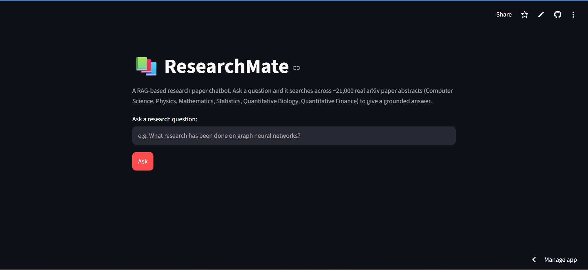
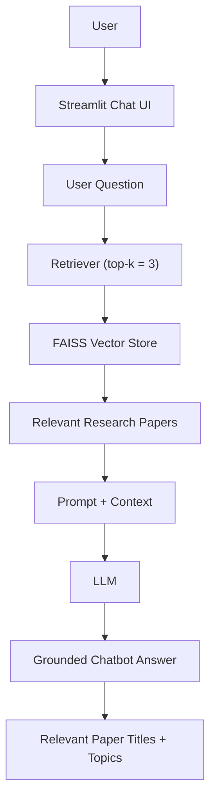

# ResearchMate — Research Paper RAG Chatbot

A RAG-based (Retrieval-Augmented Generation) chatbot built with LangChain that answers questions
by searching across a corpus of ~21,000 real research paper abstracts and generating an answer
grounded in the retrieved content.

This is **not** a "chat with one PDF" project — it searches across many papers at once and
synthesizes an answer from whichever are most relevant to the question.

## Screenshot



## Problem Statement

Most beginner RAG demos are built around a single document (a PDF, a book, a YouTube transcript).
ResearchMate instead indexes a whole collection of independent research paper abstracts, so a
single question can pull together information from multiple different papers — closer to
"research discovery" than single-document Q&A.

## Dataset

**Topic Modeling for Research Articles** (JanataHack, Independence Day 2020)
Kaggle: https://www.kaggle.com/datasets/blessondensil294/topic-modeling-for-research-articles

- ~21,000 real research paper abstracts
- Columns: `ID`, `TITLE`, `ABSTRACT`, plus 6 topic flags (Computer Science, Physics, Mathematics,
  Statistics, Quantitative Biology, Quantitative Finance)
- One near-empty abstract (1 word) was identified and removed during data preparation

## Architecture



## Technologies Used

| Component | Choice | Why |
|---|---|---|
| Framework | LangChain (LCEL) | Standard RAG orchestration |
| Embeddings | `sentence-transformers/all-MiniLM-L6-v2` (local, via HuggingFace) | Free, fast, no API key needed, well-known baseline for semantic search |
| Vector Store | FAISS | Free, local, simple, handles this corpus size easily |
| LLM | Groq (`openai/gpt-oss-20b`) | Free tier, very fast inference, simple LangChain integration |
| UI | Streamlit | Simple, fast to build a clean web interface |

## RAG Workflow

1. **Data preparation** — combine `TITLE` + `ABSTRACT` into one text field; build a readable
   `topics` field from the 6 topic flags.
2. **Document creation** — wrap each row into a LangChain `Document` (`page_content` = text,
   `metadata` = id/title/topics).
3. **Text splitting** — `RecursiveCharacterTextSplitter`, with `chunk_size` set above the
   measured maximum abstract length, so in practice each abstract stays as a single chunk
   (confirmed empirically, not assumed).
4. **Embeddings** — each chunk is embedded into a 384-dimensional vector capturing its meaning.
5. **Vector store** — all embeddings are indexed in FAISS, linked to their original text and
   metadata, and saved to disk for reuse.
6. **Retriever** — wraps the vector store in a standard interface; given a question, returns the
   top-3 most similar documents.
7. **RAG chain (LCEL)** — retrieved documents are formatted into context, combined with the
   question in a prompt, sent to the LLM, and parsed into a plain-text answer.
8. **Structured output** — the answer (LLM-generated) is combined with the relevant paper titles
   and topics (taken directly from retrieval metadata, not regenerated by the LLM, to avoid
   hallucinated titles).

## How Retrieval Works

The question is embedded using the same model used to embed the documents, placing it in the
same 384-dimensional vector space. FAISS then finds the `k=3` document vectors with the smallest
distance to the question vector — i.e. the most semantically similar abstracts — and returns
them along with their original text and metadata.

## How to Run Locally

1. Clone this repository.
2. Unzip the FAISS index into a `faiss_index/` folder in the project root (or rebuild it using
   the Stage 6/7 notebooks).
3. Create a `.env` file (not committed to Git) containing:
   ```
   GROQ_API_KEY=your_key_here
   ```
4. Install dependencies:
   ```
   pip install -r requirements.txt
   ```
5. Run the app:
   ```
   streamlit run app.py
   ```

## Live Demo

**https://researchmate-rag-chatbot-bclsannn85qzgk88hcdvuf.streamlit.app**

## Deployment

Deployed via GitHub → Streamlit Community Cloud. The Groq API key is stored using Streamlit
Cloud's Secrets manager, never committed to the repository.

## Limitations

- **Keyword ambiguity:** a question like "transformer efficiency" can retrieve lexically similar
  but semantically wrong results (e.g. electrical power transformers instead of the Transformer
  neural network architecture), especially when the corpus itself has limited coverage of the
  intended topic. The LLM is prompted to recognize and flag this rather than hallucinate an
  answer — verified directly through testing.
- **No relevance threshold:** the retriever always returns its top-k closest matches, even when
  none are genuinely relevant. The LLM's prompt is what catches this, not the retriever itself.
- **Small, fixed corpus:** limited to ~21,000 abstracts from one Kaggle dataset (2020 snapshot) —
  no live/updating paper ingestion.
- **No conversational memory:** each question is handled independently; the app does not track
  multi-turn conversation context.

## Future Improvements

- Add a distance-based confidence threshold to explicitly flag low-confidence retrievals in the UI.
- Support filtering by topic before retrieval.
- Expand or refresh the underlying dataset.
- Add simple conversational memory for follow-up questions.
